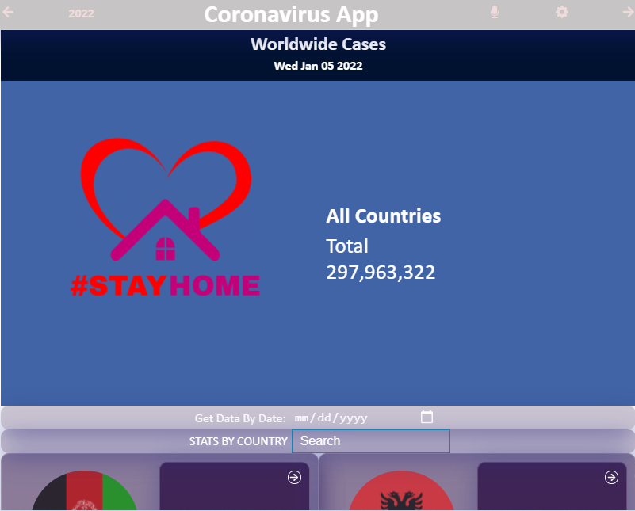
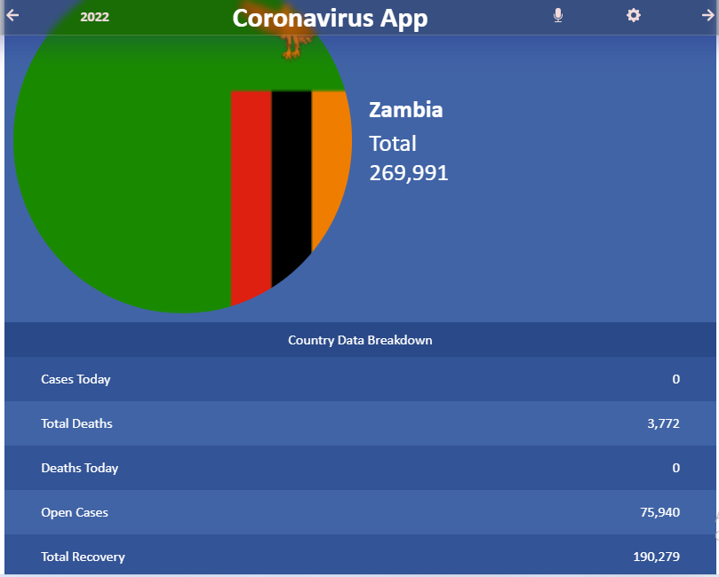

# Covid19-Cases

- In this repo I was to select an API that provides numeric data about a topic that I would like and then build the webapp around it. The webapp will have several pages:
  - one page with a list of items that could be filtered by some parameters.
  - one page for the item details.

## Project Description
> Click [here](https://loom.com/share/eb9f9d4ce19942628b7c2aa2a74105c2) to watch a video that gives a brief description of the project

## Live Demo
> Click [here](https://elated-roentgen-42cb41.netlify.app/) to see the live demo


ItemsList page                              |  ItemDetails page
:------------------------------------------:|:------------------------------------------:
   |   

### Built With

- [React](https://es.reactjs.org/)
- [HTML](https://www.w3schools.com/html/)
- [CSS](https://www.w3schools.com/css/)
- [JS](https://www.javascript.com/)

# Getting Started with Create React App

This project was bootstrapped with [Create React App](https://github.com/facebook/create-react-app).

### Installation

1. Clone the repository
   ```sh
   git clone https://github.com/mwanawabangona/Covid19-Cases.git
   ```
2. Install NPM packages
   ```sh
   npm install
   ```
3. Run server
   ```sh
   npm start
   ```
## Author

👤 **Ellis ngona**

- GitHub: [@mwanawabangona](https://github.com/mwanawabangona)
- Twitter: [@Ellis_aah](https://twitter.com/Ellis_aah)

## 🤝 Contributing

Contributions, issues, and feature requests are welcome!

Feel free to check the [issues page](../../issues/).

## Acknowledgments
Microverse

React and React Router documentation

Hats off to [Nelson Sakwa](https://www.behance.net/sakwadesignstudio) for the design inspiration.


## Show your support

Give a ⭐️ if you like this project!